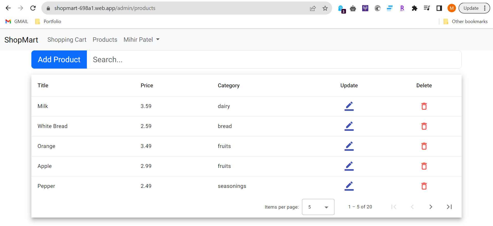
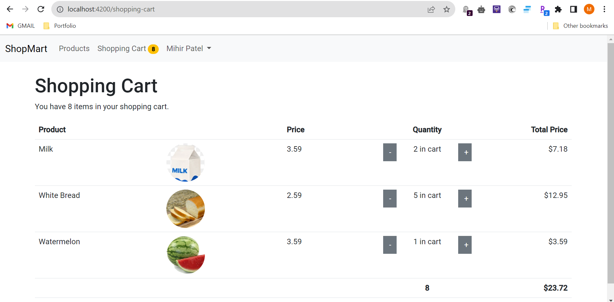
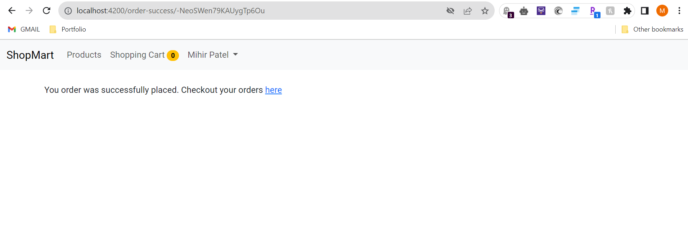

# ShopMart
<p>
An online shopping application built using Angular. It features user-authentication using Firebsae Google Auth Provider. Protected links that are only visible to admin and some requires uers to be logged in. It allows users to filter display products based on categories. Users can add/remove products to/from cart. Displays total car value and all the cart items in shopping cart page. Needs to add shipping details for placing orders. 

Current features and visibility:

Home,<br>
Shopping Cart,<br>
Products,<br>
Check Out,<br>
Place Order,<br>
My Orders,<br>
Manage Products - Login reguired (admin only),<br>
Manage Products -> Add Products - Login reguired (admin only), <br>
Manage Orders - Login reguired (admin only), <br>

### Products
Provides categories filter to display products only related to category. Sticky options so that categories can be selected while scrolling products.

AddToCart and RemoveFromCart features which takes shopping cart id or creates one and add or remove items from the cart.

Displays button to increment or decrement the quantity of the product and number of quantity of the product in the cart.

Seperated component of product card and product category filter for making them reusable and readbility of the code.

### Shopping Carts
Displays total quantity of the cart on navbar in a pill. Automatically updates when quantity of product in cart changes.

It shows a list of products in cart and the quantiy, price and total price of each product.

It also shows the total value of the cart along with total quantity.

Can checkout the cart which requires users to add shipping address and then place order.

All the orders are saved and can be managed by admins.

### Manage Products -> Add Products
Adding product using Template driven forms
Serverless Application built upon Firebase
Added Search, Update, Delete and Cancel operations for the product.

Modified the products UI with additional features of pagination, sorting and search built using Angular Material.
 
</p>

## Local Development

Setup you own firebase project then,

Add new folder named environments in src folder

Inside that folder add file named environments.ts with following contents

```
export const environment = {
    production: false,
    firebase: {
        apiKey: "",
        authDomain: "",
        projectId: "",
        storageBucket: "",
        messagingSenderId: "",
        appId: "",
        measurementId: ""
    }
};
```

Add file named environments.development.ts with following contents

```
export const environment = {
    production: true,
    firebase: {
        apiKey: "",
        authDomain: "",
        projectId: "",
        storageBucket: "",
        messagingSenderId: "",
        appId: "",
        measurementId: ""
    }
};
```

Run `ng serve` for a dev server. Navigate to `http://localhost:4200/`. The application will automatically reload if you change any of the source files.

## Live Deployment

https://shopmart-698a1.web.app/

## Snap Shots

1. Home Page 


2. Admin Add New Product 


3. Admin Procducts 



4. Admin Procducts Filter and Sort


5. Update Product 


6. Products Page


7. Products Filtered by selected category


8. Products Sticky Options


9. Add Product To Cart


10. Remove Product From Cart


11. Shopping Cart



11. Remove Product From Shopping Cart


11. Clear Shopping Cart


12. Updated Shopping Cart with Checkout


13. Check Out


14. Successfully Order Placed



15. My Orders


16. Admin Manage Orders

